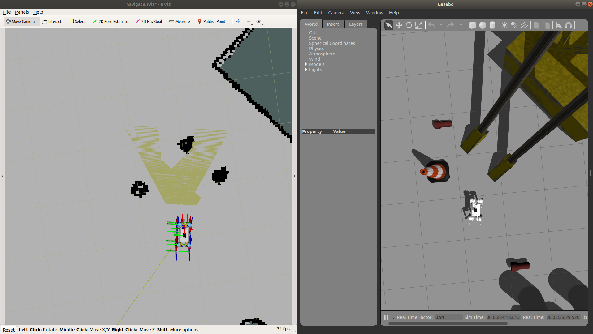
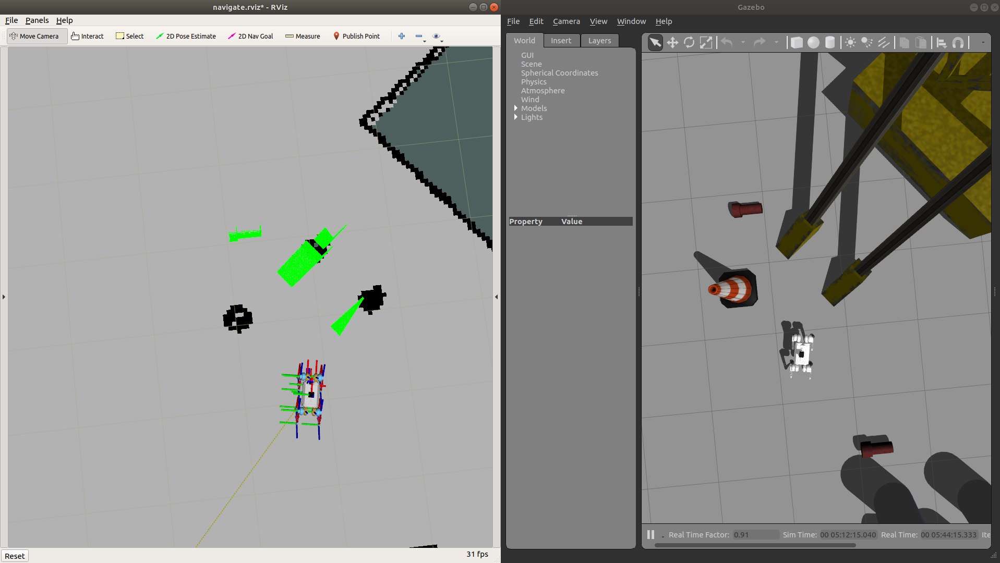
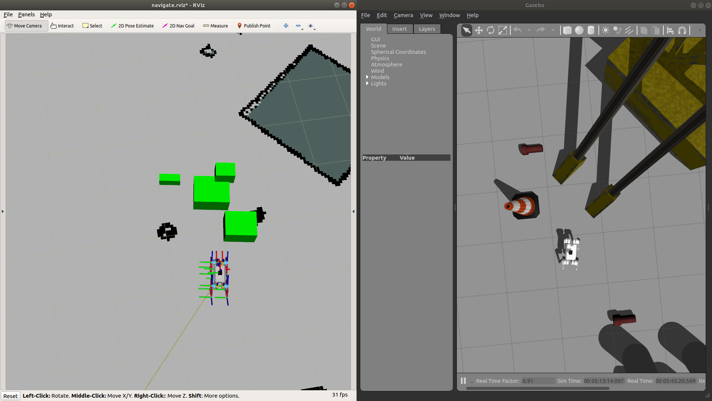
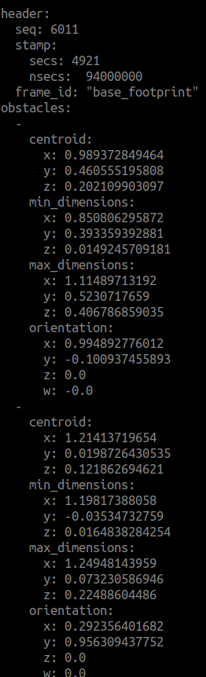

# PCL Obstacle Clustering

## Overview

A simple [ROS] package that segments the input point cloud in order to remove the plane, and proceeds to cluster the non-planar point cloud.

## Installation

### Dependencies

This software is built on the Robotic Operating System ([ROS]), which needs to be [installed](http://wiki.ros.org) first.

- [Eigen](http://eigen.tuxfamily.org) (linear algebra library).
- [Point Cloud Library (PCL)](http://pointclouds.org/) (point cloud processing)

### Building

In order to install the package, clone the latest version from this repository into your catkin workspace and compile the package using ROS.

    cd catkin_workspace/src
    git clone https://github.com/itaouil/obstacle_clustering.git
    cd ../
    catkin config --cmake-args -DCMAKE_BUILD_TYPE=Release
    catkin build

## Basic Usage

In order to get the obstacle clustering package, you might need to adapt a few parameters (mainly just the **Frame ID** for the reference frame you would like the object information to be in, and the **point cloud input topic**). Such info can be easily changed in the **config.h** file inside the config folder and that looks like this:

    #ifndef OBSTACLE_CLUSTERING_CONFIG_H
    #define OBSTACLE_CLUSTERING_CONFIG_H
    
    #include <utility>
    #include <iostream>
    
    // Frame ID reference for obstacle information
    const std::string FRAME_ID("base_footprint");
    
    // Topic name where the PointCloud2 message is published
    const std::string POINT_CLOUD_TOPIC("/camera/depth/points");
    
    // Publishers topic
    const std::string SEGMENTED_PLANE_TOPIC("/segmented_plane");
    const std::string OBSTACLES_INFORMATION_TOPIC("/obstacles");
    const std::string BOX_MARKERS_TOPIC("/visualization_markers");
    const std::string CLUSTERED_NON_PLANAR_TOPIC("/clustered_non_planar");
    
    #endif //OBSTACLE_CLUSTERING_CONFIG_H

The package can be launched as follows:

    rosrun obstacle_clustering clustering

### Published Topics

* **`segmented_plane`** ([sensor_msgs/PointCloud2]) 
  
    The segmented plane through PCL.
  
* **`clustered_non_planar`** ([sensor_msgs/PointCloud2]) 
  
    The clustered objects that dont belong to the plane

* **`visualization_markers`** ([visualization_msgs::MarkerArray])
  
    Box markers that englobe the clustered objects

* **`obstacles`** ([obstacle_clustering::Obstacles])
  
    List of obstacle information

